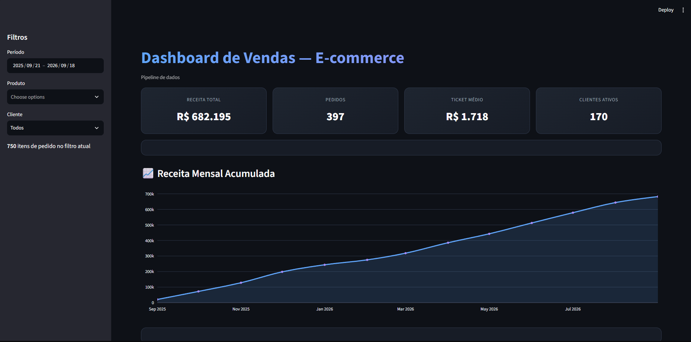
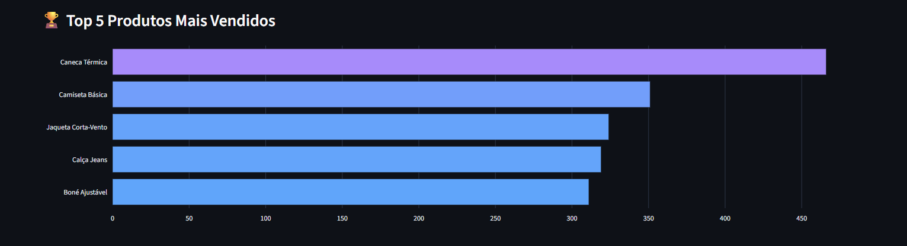
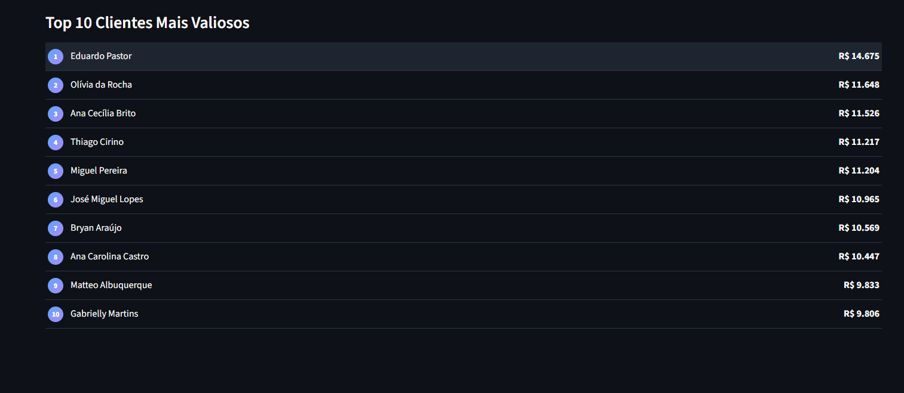

🔗 **[Ver dashboard ao vivo](https://dadosecommerce.streamlit.app/)**


# 📊 Dashboard de Vendas — E-commerce (Portfolio Data Engineering)

Pipeline de dados ponta a ponta simulando um cenário real de vaga júnior de dados: banco relacional, processamento em nuvem AWS, e visualização interativa.

**Stack:** PostgreSQL → Python (pandas/boto3) → AWS S3 → Streamlit

---

## 🖼️ Preview

### Visão geral


### Produtos mais vendidos


### Clientes mais valiosos


---

## 🎯 Sobre o projeto

Este projeto simula o fluxo de dados de uma loja de e-commerce fictícia: desde a modelagem do banco relacional até um dashboard interativo publicado na nuvem, passando por um data lake simples no AWS S3.

O objetivo foi praticar, de ponta a ponta, o tipo de pipeline que aparece em vagas júnior de dados: **modelagem de banco → SQL avançado (window functions) → ETL → armazenamento em nuvem → visualização**.

## 🏗️ Arquitetura

PostgreSQL (dados transacionais)
│ 4 tabelas relacionadas: clientes, produtos, pedidos, itens_pedido
▼
Python (pandas + psycopg2)
│ JOIN consolidado das 4 tabelas em um único dataset
▼
CSV consolidado
│ upload via boto3
▼
AWS S3 (data lake)
│ bucket privado, acesso via política IAM de menor privilégio
▼
Python (boto3 + pandas)
│ leitura em memória (sem escrita em disco)
▼
Streamlit + Plotly (dashboard)
│ deploy público no Streamlit Community Cloud


## 🧰 Tecnologias

- **PostgreSQL** — banco de dados relacional, modelagem normalizada
- **Python** — psycopg2, pandas, boto3, Faker
- **AWS S3** — armazenamento intermediário (data lake), com IAM configurado seguindo princípio de menor privilégio
- **Streamlit + Plotly** — dashboard interativo com filtros e gráficos

## 🗄️ Modelagem do banco

4 tabelas relacionadas por chave estrangeira:

- `clientes` — dados cadastrais
- `produtos` — catálogo da loja
- `pedidos` — um pedido por cliente, com data e status
- `itens_pedido` — tabela associativa (produto + pedido + quantidade + **preço no momento da venda**, para preservar histórico mesmo se o preço do produto mudar depois)

## 🔍 Destaques técnicos

- **Window functions em SQL**: `RANK()`, `DENSE_RANK()`, `ROW_NUMBER()`, `SUM() OVER()` para receita acumulada, e `PARTITION BY` para ranking por cliente
- **Princípio de menor privilégio na AWS**: política IAM customizada, restrita a um único bucket S3, sem usar políticas genéricas como `AmazonS3FullAccess`
- **Leitura em memória do S3**: uso de `StringIO` para processar o CSV sem escrever em disco — necessário para rodar corretamente em ambientes de deploy (containers efêmeros)
- **Credenciais nunca hardcoded**: uso de `.env` localmente e do sistema de *Secrets* do Streamlit Cloud em produção

## 🚀 Como rodar localmente

### Pré-requisitos
- Python 3.10+
- PostgreSQL instalado
- Conta AWS com um bucket S3 configurado

### Passos

```bash
# Clonar o repositório
git clone https://github.com/PdrAugusto/ecommerce-data-portfolio.git
cd ecommerce-data-portfolio

# Criar e ativar ambiente virtual
python -m venv venv
venv\Scripts\Activate.ps1     # Windows
# source venv/bin/activate    # Linux/Mac

# Instalar dependências
pip install -r requirements.txt
```

Cria um arquivo `.env` na raiz do projeto com:

DB_HOST=localhost
DB_NAME=ecommerce
DB_USER=postgres
DB_PASSWORD=sua_senha
AWS_ACCESS_KEY_ID=sua_access_key
AWS_SECRET_ACCESS_KEY=sua_secret_key
AWS_REGION=us-east-1


Depois, popular o banco e gerar os dados:

```bash
python scripts/gerar_dados.py
python scripts/gerar_produtos.py
python scripts/gerar_pedidos.py
python scripts/gerar_itens_pedido.py
python scripts/exportar_csv.py
python scripts/upload_s3.py
```

Rodar o dashboard:

```bash
streamlit run dashboard.py
```

## 📈 Melhorias futuras

- Adicionar filtro por status do pedido (exigiria ajustar a query de exportação)
- Migrar o Postgres para o AWS RDS (versão cloud completa)
- Automatizar a exportação/upload com agendamento (ex: Airflow ou cron)

## 👤 Autor

Pedro — [www.linkedin.com/in/pedro-augusto-9734b8204](#) · [https://github.com/PdrAugusto?tab=repositories](#)

Projeto desenvolvido como parte de um estudo estruturado de Data Engineering, combinando PostgreSQL, AWS e Python.